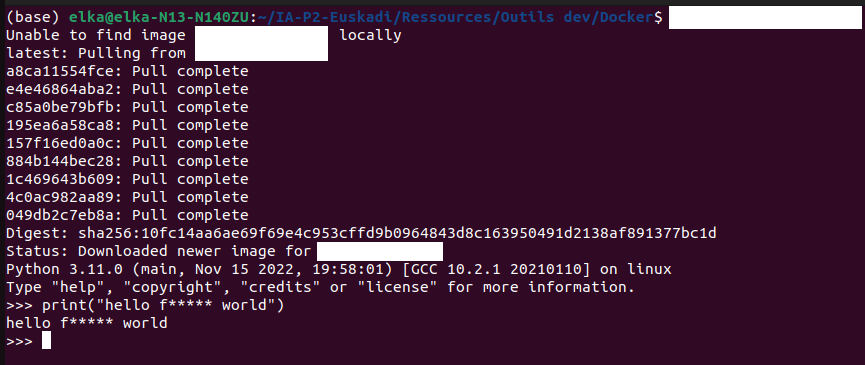
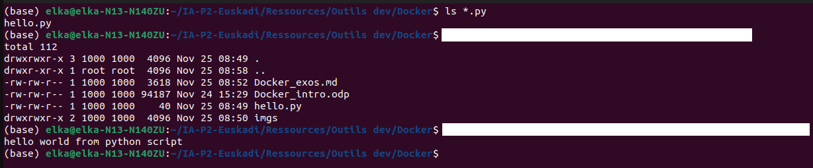
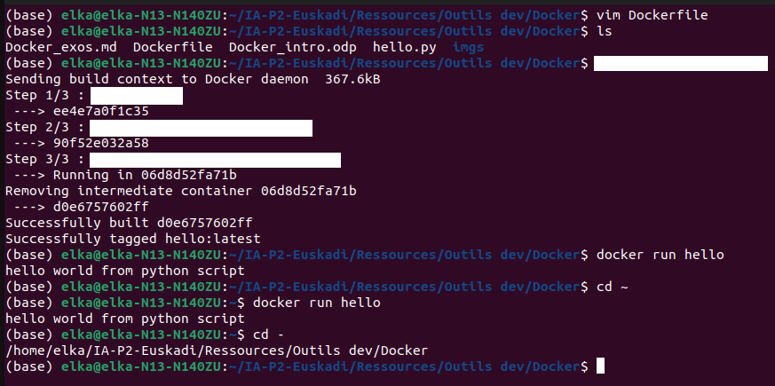
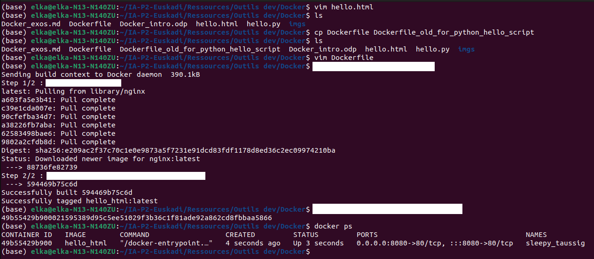

# Exercices pratiques Docker

## Exercice 0

**Objectif :** installer Docker et lancer son premier conteneur

1. Installer Docker CE en suivant [la doc officielle](https://docs.docker.com/get-docker/) ou autres tutos d'install qui vous plaisent !
> * sur Ubuntu : https://www.digitalocean.com/community/tutorials/how-to-install-and-use-docker-on-ubuntu-22-04  
> * sur Windows : https://www.simplilearn.com/tutorials/docker-tutorial/install-docker-on-windows ou https://www.geeksforgeeks.org/how-to-install-docker-on-macos/
> * sur Mac : https://runnable.com/docker/install-docker-on-macos ou https://www.geeksforgeeks.org/how-to-install-docker-on-macos/

2. Exécuter successivement les commandes `$ docker pull ubuntu:22.04` et `docker run -it ubuntu:22.04` dans votre terminal. Que se passe-t-il ? Ça y est, vous avez lancé votre premier conteneur.

3. Trouver comment faire (dans l'ordre) les opérations suivantes (et faites-le évidemment !):
> * quitter le conteneur
> * lister les conteneurs (actifs et inactifs)
> * supprimer un conteneur
> * lister les images Docker
> * supprimer une image

https://collabnix.com/docker-cheatsheet/

## Exercice 1

**Objectif :** prise en main de Docker et ses commandes de base.

1. Démarrer un container interactif de l'image python 3 et y écrire un `print("hello world")` dans le shell interactive python. Puis quitter le shell interactif python.
> _Note 1 : le côté interactif se fait avec les options "-it"_  
> _Note 2 : Le nom et le tag d'une image python est à chercher sur le Docker HUB_  

> L'output doit ressembler à ça :

2. Sur votre OS principal, écrire un fichier hello.py avec un `print("Hello World")` dedans.
> a) Démarrer un container en ajoutant un volume hôte entre votre répertoire courant et le répertoire `/src` sur le container, et avec `ls` vérifier au lancement du container que le répertoire courant a été correctement monté  
> b) Même chose que a) mais cette fois en exécutant le script python directement au lancement du container.  

> Vous devez obtenir les sorties suivantes :

## Exercice 2

**Objectif :** créer une image docker personnalisée autonome contenant notre fichier hello.py, permettant ainsi de s'affranchir d'un volume

* Créer un Dockerfile, avec les instructions `FROM`, `COPY` (ou `ADD`, profitez-en pour regarder la différence) et `CMD`
* Construire l'image à partir de ce Dockerfile et la nommer `hello`
* Créer un container à partir de cette image `hello`, sans aucune option particulière.

## Exercice 3

**Objectif :** un Hello World d'une image nginx en utilisant un container détaché à durée de vie longue

1. Ecrire un fichier hello.html avec comme contenu `<h1>Hello, World!</h1>`
2. Créer un fichier Dockerfile (**/!\\ Un seul Dockerfile par dossier /!\\**)
>- héritant de l'image de base "nginx:latest",  
>- y copier le fichier "hello.html" dans le répertoire "/usr/share/nginx/html/"  
3. Constuire cette image
4. Démarrer un nouveau container depuis cette image, en utilisant l'option "détaché" et en utilisant l'option de publication de port.
5. Se connecter à http://localhost:[port_externe]/hello.html

6. Alternative : sans utiliser de Dockerfile, créer un container détaché avec l'option de publication de port de l'image nginx et en ajoutant un volume hôte entre votre répertoire courant et le répertoire "/usr/share/nginx/html/". Vous devez pouvoir accéder au fichier html maias pas uniquement ! Que se passe-t-il lorsque vous accéder à http://localhost:[port_externe]/hello.py par exemple ?

## Exercice 4

**Objectif :** créer une image Docker de votre projet Flask

1. Créer un réseau docker "flask_net"
2. Créer un volume "mariadb_data"
3. Démarrer un container "mariadb" en l'associant au réseau "flask_net" et au volume "mariadb_data", en suivant bien sûr la documentation du docker hub concernant cette image.
4. Créer un fichier Dockerfile avec l'ensemble des instructions nécessaire pour copier votre projet flask dans le dossier de votre choix (mais `/src` est par mal), et l'exécuter au démarrage de votre container. Construire cette image.
5. Démarrer un nouveau container basé sur votre image, en l'associant au réseau "flask_net" et en définissant la bonne publication de port. Accéder ensuite à votre projet via http://localhost:[port_externe]/
6. Reprendre la même chose en utilisant Docker-compose.
