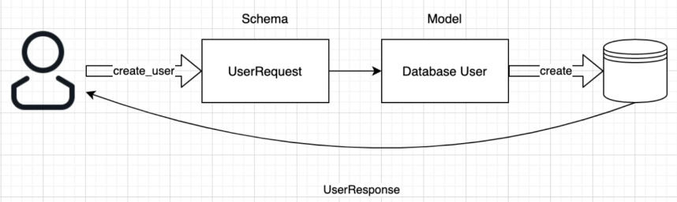
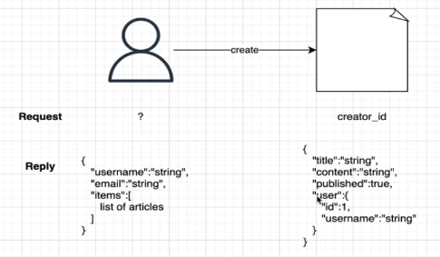

# Introduction aux API REST et à FastAPI

<!-- TOC tocDepth:2..3 chapterDepth:2..6 -->

- [1. Lexique](#1-lexique)
- [2. Les API et les API REST](#2-les-api-et-les-api-rest)
    - [2.1. Les API](#21-les-api)
    - [2.2. Les API REST](#22-les-api-rest)
    - [2.3. OpenAPI et Swagger](#23-openapi-et-swagger)
- [3. FastAPI](#3-fastapi)
    - [3.1. Caractéristiques](#31-caractéristiques)
    - [3.2. Méthode GET](#32-méthode-get)
    - [3.3. Description des opérations](#33-description-des-opérations)
    - [3.4. Routeurs](#34-routeurs)
    - [3.5. Les paramètres](#35-les-paramètres)
    - [3.6. Bases de données](#36-bases-de-données)

<!-- /TOC -->

## 1. Lexique
- API : Application Programming Interface (ou interface de programmation d'application)
- REST : Representational State Transfer (ou transfert d'état de représentation)
- path : endpoints qui sont exposés par l'API
- opérations : méthodes HTTP utilisées pour manipuler les path (GET, POST, DELETE)

## 2. Les API et les API REST

### 2.1. Les API

- permettent de communiquer des données entre différents composants de votre application et entre votre application et d'autres développeurs, par l'utilisation de requêtes et de réponses.
- donnent un moyen d'accès aux données de façon réutilisable et standardisée.
- API publiques utilisables par tous sans restriction
- API privées utilisables seulement par ceux qui ont un accès et y sont autorisés

Des exemples d'API : API météo, API spotify, API instagram, API de connexion Google ou Facebook

[Une liste d'API publiques](https://github.com/toddmotto/public-apis)

### 2.2. Les API REST

- un ensemble de normes, ou de lignes directrices architecturales qui structurent la façon de communiquer les données
- basé sur le protocole HTTP pour transférer les informations 
- 6 lignes directrices architecturales clés pour les API REST :
    1. *Client-server separation* : moyen de communication standardisé entre le client et les données (peu importe le client et le serveur, ce qui compte c'est comment ils échangent les informations)
    2. *Stateless* : le serveur ne sauvegarde aucune des requêtes ou réponses précédentes, cela implique que chaque requête et chaque réponse soit indépendante déterminée et compréhensible
    3. *Cacheable* : la réponse peut être mise en cache pour le client
    4. *Uniforme Interface* : utilisation des mêmes normes afin que chaque API ait une interface uniforme 
    5. *Layered system* : chaque composant qui utilise REST n'a pas accès aux composants au-delà du composant précis avec lequel il interagit
    6. *Code on demand* : le serveur peut envoyer le code au client pour téléchargement (même si le client ne pourra nécessairement éxecuter le code)

### 2.3. OpenAPI et Swagger

[OpenAPI Specification](https://swagger.io/docs/specification/about/) c'est un format de description des API REST, qui permet de décrire toute l'API, avec :
- ses endpoints et opérations sur chaque endpoints
- les paramètres et résultat de chaque opération
- les méthodes d'authentification
- les information de contact, licence, etc...

[Swagger](https://swagger.io/) est un ensemble d'outils open-source construits autour de OpenAPI Specification pour la manipulation et l'utilisation d'API REST. On trouve un éditeur, une UI, un générateur de code, etc...

## 3. FastAPI

### 3.1. Caractéristiques

- documentation automatique :
    - Swagger (`/docs`) 
    - Redoc (`/redoc`)
- python 3
- gestion de dépendances
- sécurité et authentification sont intégrés
- testing

### 3.2. Méthode GET

#### 3.2.1. Paramètres path

- paramètres du chemin de l'url `/path/to/object/number/{int}`
- validation du type
- utilisation de Pydantic (libraire pour la validation des données)
- l'ordre est important !

#### 3.2.2. Paramètres prédéfinis

- paramètres path qui ne peuvent prendre que des valeurs prédéfinies
- utilisation de Enum

#### 3.2.3. Paramètres de requêtes

*exemple : http://localhost:8000/blogs/all?page=2&page_size=10*

- paramètres de requêtes (query parameters) : `page` et `page_size`
- tous les paramètres de la fonction qui **ne sont pas des paramètres du path**
- valeurs par défaut
- paramètres optionnelles

=> mélange de paramètres path et de paramètres de requêtes (avec valeurs par défaut et optionnelle)

### 3.3. Description des opérations

#### 3.3.1. Status code

- Code du statut de la réponse, càd le résultat de l'opération
- Modification du statut
- Modification du statut **sur l'objet la réponse**

#### 3.3.2. Tags

- catégorise les opérations
- multiples tags possibles

#### 3.3.3. Résumé et description de l'opération

- information à propos de l'opération (directement en paramètres de l'opération)
- utilisation du docstring de la fonction

#### 3.3.4. Description de la réponse

- information à propos de l'output

### 3.4. Routeurs

Les routeurs permettent de structurer l'application en différents fichiers/composants :

- pour séparer les opérations en plusieurs fichiers
- possibilité de mettre des préfixes
- possibilité de mettre des tags

On les importe ensuite directement dans le fichier `main.py`

### 3.5. Les paramètres

#### 3.5.1. Le corps de la requête (paramètres Body)

Pour passer des paramètres non pas dans la query mais dans le corps de la requête.

- Méthode POST
- Pydantic *BaseModel* pour convertir les données depuis le json vers le modèle de l'API
- FastAPI fait la validation des données, la conversion dans le modèle et en JSON

#### 3.5.2. Paramètres Path et Query et Body

On peut combiner tous les paramètres et FastAPI les gère très bien conjointement simplement à partir des "déclarations de type".

#### 3.5.3. Métadata

- information visible dans les docs
- utilise les constructeurs `Query`, `Path` et `Body`
- ajout d'un titre, d'une description, d'un alias et éventuellement dépréciation

#### 3.5.4. Validateurs
- valide les données qu'on passe aux paramètres
- possibilité de passer un paramètre par défaut
- possibilité de rendre un paramètre non optionnel (requis)

**Pour les chaînes de caractères :**
- possibilité de forcer un nombre min/max de caractères
- possibilité de valider des expressions régulières


**Pour les nombres :**
- ge, le, gt, lt

#### 3.5.5. Valeurs multiples

- pour les paramètres Query
- définition d'un paramètre Query optionnel
- ajout de valeurs par défaut

#### 3.5.6. Sous-types complexes

Les modèles de Pydantic ne se restreignent pas aux types simples (string, int, ...) :
- listes, ensembles, dictionnaires, tuples
- types custom

### 3.6. Bases de données

#### 3.6.1. Intro aux dépendances

Idée générale :
- autoriser à une fonction de dépendre d'une autre fonction
- permet d'importer facilement des fonctionnalités n'importe où et donc les écrire une seule fois
- constructeur `Depends`

#### 3.6.2. Les bases de données dans FastAPI

- Fonctionne avec n'importe quelle bdd relationnelle
- librairie ORM (ici SQLAlchemy)



#### 3.6.3. Création de base et tables

Code python pour la création de la bdd SQLAlchemy

```python
from sqlalchemy import create_engine
from sqlalchemy.orm import sessionmaker, declarative_base
    
SQLALCHEMY_DATABASE_URL = "sqlite:///./fastapi-practice.db"
    
engine = create_engine(
    SQLALCHEMY_DATABASE_URL, connect_args={"check_same_thread": False}
    )
SessionLocal = sessionmaker(autocommit=False, autoflush=False, bind=engine)
    
Base = declarative_base()
```

Code python pour la création d'une table (ie un model)
```python
from .database import Base
from sqlalchemy import Column, Integer, String


class DbUser(Base):
    __tablename__ = 'users'
    id = Column(Integer, primary_key=True, index=True)
    username = Column(String)
    email = Column(String)
    password = Column(String)
```

#### 3.6.4. Écriture dans la bdd

Bdd checklist :
- définition de la bdd      = `database.py`
- définition des modèles    = `models.py`
- création de la bdd        = `main.py`
- définition des schémas     = `schemas.py`
- fonctionnalités de l'ORM  = `db_user.py`
- fonctionnalités de l'API  = `user.py`

Récap du processus pour la partie BDD :
1. import des librairies sqlalchemy et bcrypt
2. Définition de la bdd dans `database.py` et création de la bdd dans `main.py`
3. Définition des modèles (tables) de la bdd dans `models.py`
4. Définition des fonctionnalités de l'ORM pour écrire dans la bdd dans le script `db_user.py`
5. Définition des schémas dans `schemas.py` :
    - données depuis l'utilisateur : `UserBase`
    - réponse à l'utilisateur : `UserDisplay`
6. Définition des fonctionnalités de l'API dans `user.py`
7. Sur le même mode, on définit toutes les opérations CRUD (create, read, update, delete)

#### 3.6.5. Création et lecture

- création (CREATE): 
    ```python
    db.add(new_user)
    db.commit()
    db.refresh(new_user)
    ```

- lecture de tous les éléments (READ): 
    ```python
    db.query(DbUser).all()
    ```

- lecture d'un élément: 
    ```python
    db.query(DbUser).filter(DbUser.id == id).first()
    ```

#### 3.6.6. Mise à  jour et suppression

- mise à jour (UPDATE):
    ```python
    user = db.query(DbUser).filter(DbUser.id == id)
    user.update({DbUser.username: request.username, ... })
    db.commit()
    ```

- suppression (DELETE):
    ```python
    user = db.query(DbUser).filter(DbUser.id == id).first()
    db.delete(user)
    db.commit()
    ```
    
#### 3.6.7. Relations

Pour une relation user - articles définie comme suit :


- définition de la relation dans les modèles 
```python
items = relationship('DbArticle', back_populates='user')
```
```python
user_id = Column(Integer, ForeignKey('users.id'))
user = relationship("DbUser", back_populates='items')
```

- et définition des éléments qu'on veut récupérer dans les schémas
```python
class UserDisplay(BaseModel):
  ...
  items: List[Article] = []
  ...

class ArticleDisplay(BaseModel):
  ...
  user: User
  ...
```
